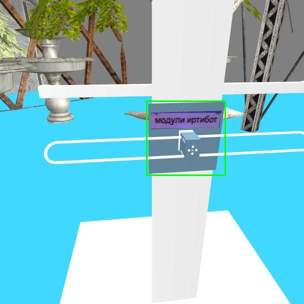
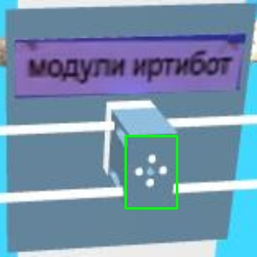
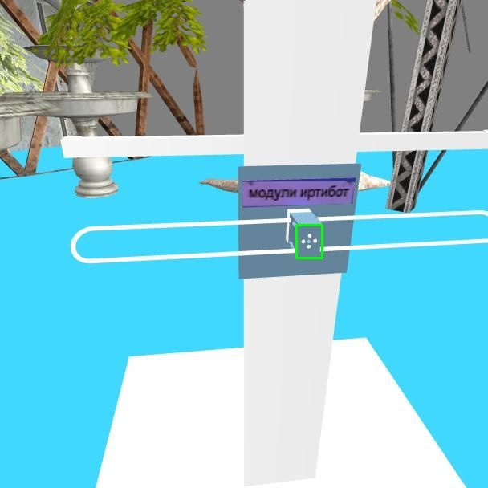

# iarc_ml

## Weights

Download the weights from these drive links and keep it in the *backup* folder.

- [board](https://drive.google.com/file/d/1W63HaBdtmTq_cT1u0SDh5tvrRmQTD4zI/view?usp=sharing)
- [module](https://drive.google.com/file/d/1-aGdPU61z8n1VrkYkSnyJPlVrKuZUq4A/view?usp=sharing)

## Usage 

A class *Darknet* is defined and both the pytorch models are instances of this class.

`model=Darknet('cfg/cfg_file.cfg',inference=True)`

`model.load_weights('backup/weights_file.weights')`

`model.cuda()`

Two functions *my_detect* and *end_to_end* are defined in *iarc.py*.

`ret,x1,y1,x2,y2=my_detect(model,cv_img)`

Expects the cv_img in BGR format with entries in [0,255] and the pytorch model.
Returns a list of boolean flag (true if bbox predicted) and four integers (x1,y1) is the coordinate of top left corner and (x2,y2) is the coordinate of the bottom right corner. Returns 0 if no box is detected. (Note : x axis is the width of image)

`ret,x1,y1,x2,y2=end_to_end(board,module,cv_img)`

Expects the cv_img in BGR format with entries in [0,255] and both pytorch models.
Directly returns coorinates of bounding box of module from raw image. Format is similar as above.

## Pictures

- `ret,x1,y1,x2,y2=my_detect(board,cv_img)`

- `ret,x1,y1,x2,y2=my_detect(module,cv_img)`

- `ret,x1,y1,x2,y2=end_to_end(board,module,cv_img)`

